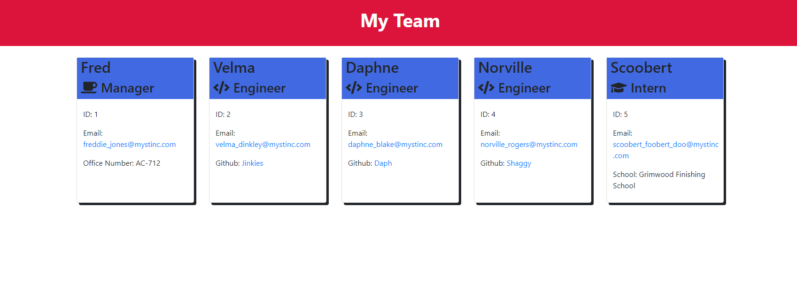

# team-profile-generator

## Description

An application that runs on the command line and generates a README.md based off of the user's input.

## Installation

1. Download the files
2. From the command line in the same folder as index.js run: npm install inquirer@8.2.4

## Usage

Run the application from the command line in the folder index.js is in. Run it with the command: node index.js.

## Screenshot

## Tutorial Video

[Tutorial Video](./assets/imgs/team-profile-generator-tutorial.mp4)

## Built With

- JavaScript
- NodeJS
- Inquirer
- Jest

## Questions

If you have any questions, please contact at [GitHub/JonathanGibbings](https://github.com/JonathanGibbings/).
